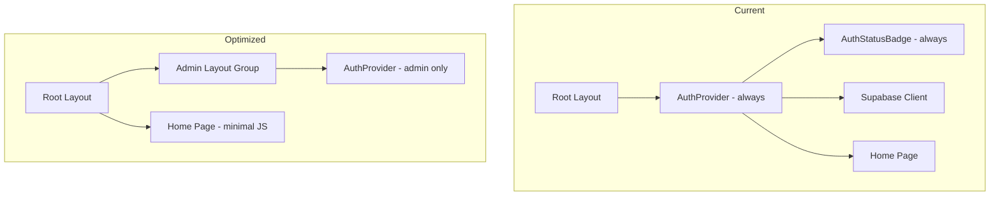

# thuh.cool Web Performance and Principles Plan

## Part 1: Principles for a Good Personal Branding Web Page

A strong personal site balances **performance**, **identity**, and **trust** so visitors get a fast, memorable, and credible experience.

### Core Performance Principles (Lighthouse-aligned)

- **FCP < 1.8s** – First paint feels instant; avoids “blank page” feeling  
- **LCP < 2.5s** – Largest content (hero, headline, main image) visible quickly  
- **TBT < 200ms** – Minimal main-thread blocking so interactions feel responsive  
- **CLS < 0.1** – No layout jumps; stable, predictable layout  
- **INP < 200ms** – Clicks/scrolls feel instant

### Identity and UX Principles

- **Single clear narrative** – Who you are and what you do in seconds  
- **Distinct typography** – 2–3 fonts max; handwriting for personality, sans for legibility  
- **Focused palette** – Dark or light theme; one primary accent (e.g. orange)  
- **Minimal hero** – One LCP element (image or headline) so the eye knows where to look

### Trust and Best Practices

- **HTTPS** – Always  
- **Mobile-first** – Core content and layout usable on small screens  
- **Accessible** – Semantic HTML, contrast, keyboard nav, ARIA where needed  
- **SEO** – Meta title, description, Open Graph for sharing

### What “Best State” Looks Like for thuh.cool

| Metric            | Current | Target  |
| ----------------- | ------- | ------- |
| Performance Score | 74      | 95+     |
| FCP               | 0.7s ✓  | < 0.8s  |
| LCP               | 0.9s ✓  | < 1.2s  |
| Speed Index       | 1.7s    | < 1.5s  |
| TBT               | 510ms   | < 200ms |
| INP               | 518ms   | < 200ms |
| CLS               | 0 ✓     | < 0.1   |

**Note:** The worst long task (518ms) in the report comes from a **Chrome extension** (hfgkoaengklibhfagaababcngpehggmm), not your site. Retesting in Incognito without extensions should show better scores, but the plan below still optimizes your own code.

---

## Part 2: Current State Analysis (from [24feb_lighthouse_report.json](docs/24feb_lighthouse_report.json))

**What’s good:** FCP, LCP, CLS, Accessibility, Best Practices, SEO all score 90–100.

**Main issues:**

1. **Render-blocking CSS** – `8451cda14210e22b.css` (~10KB) blocks initial render
2. **Unused JavaScript** – ~770 KiB wasted; `ca377847-a39cea5c8840ecb9.js` ~94% unused
3. **Legacy JavaScript** – ~11 KiB of polyfills for older browsers
4. **Speed Index** – 1.7s, room to improve above-the-fold content
5. **Heavy client bundles on home** – AuthProvider, AuthStatusBadge, Supabase client loaded for all visitors

---

## Part 3: Optimization Plan

### Phase A: Critical Path (Biggest Impact)

#### 1. Defer Auth Context to Authenticated Routes Only

- **Problem:** [layout.tsx](src/app/layout.tsx) wraps the whole app in `AuthProvider` and `AuthStatusBadge`, pulling in Supabase and auth logic on every page  
- **Change:** Move `AuthProvider` into a layout that only wraps `/admin/`* and auth-related pages; make `AuthStatusBadge` a route-group layout component so it’s only rendered where needed  
- **Impact:** Large reduction in main-thread work and JS on the home page

#### 2. Eliminate Render-Blocking CSS

- **Problem:** Tailwind output blocks first paint  
- **Actions:**
  - Inline above-the-fold critical CSS (e.g. hero + nav) in `<head>` or use `critical` package
  - Mark non-critical styles with `media="print" onload="this.media='all'"` for async load
  - Or use Next.js CSS optimization / `@next/font`-style critical path handling
- **Files:** [layout.tsx](src/app/layout.tsx), [globals.css](src/app/globals.css), [next.config.js](next.config.js)

#### 3. Optimize Background Image (LCP Element)

- **Current:** [layout.tsx](src/app/layout.tsx) uses `/bg.png` with `next/image`, quality 85  
- **Actions:**
  - Add WebP/AVIF versions and use `srcSet`; Next.js Image already supports AVIF/WebP
  - Add `fetchPriority="high"` and `placeholder="blur"` with a small base64 blur
  - Preload LCP image: `<link rel="preload" as="image" href="/bg.webp" />` in layout
- **File:** [layout.tsx](src/app/layout.tsx); ensure `public/bg.webp` or `public/bg.avif` exists

#### 4. Font Loading Strategy

- **Current:** Inter, Mynerve, Playfair_Display via `next/font`  
- **Actions:**
  - Add `display: 'swap'` (or `optional`) to avoid invisible text
  - If Playfair is only used on /writing or /reading, load it dynamically on those routes
  - Subset fonts to latin if that’s all you need
- **File:** [layout.tsx](src/app/layout.tsx)

### Phase B: JavaScript and Bundle Optimization

#### 5. Route-Based Code Splitting

- **Problem:** Reading page (VoronoiMindspace, Chart.js, D3, etc.) and admin (TipTap, etc.) load on every page  
- **Already in place:** `'use client'` + `dynamic` for heavy components  
- **Action:** Audit all `'use client'` components; ensure heavy ones (VoronoiMindspace, Chart.js, TipTap) are loaded only on their routes via `next/dynamic` with `ssr: false` where appropriate

#### 6. Reduce Unused JavaScript

- **Problem:** `ca377847-a39cea5c8840ecb9.js` has ~94% unused code; Supabase and shared chunks likely over-included  
- **Actions:**
  - Use `next/dynamic` for components that need Supabase only on specific pages
  - Add `modularizeImports` in `next.config.js` for lucide-react (only import used icons)
  - Enable bundle analyzer: `@next/bundle-analyzer` to identify large modules

#### 7. Legacy JavaScript

- **Action:** Update `browserslist` in `package.json` or `.browserslistrc` to target only modern browsers (e.g. last 2 versions) so legacy polyfills are dropped

### Phase C: Interaction and Layout Polish

#### 8. ActivityTicker – Reduce Main-Thread Cost

- **Current:** [ActivityTicker.tsx](src/components/ActivityTicker.tsx) uses `useState`/`useEffect`/`setInterval`  
- **Actions:**
  - Consider `requestAnimationFrame` or `setTimeout` chains instead of `setInterval` for smoother timing
  - Or use CSS `@keyframes` + `animation` for the fade; keep JS only for cycling content (reduces repaint work)

#### 9. Long-Task Splitting

- **Site-owned tasks:** 77ms, 72ms, 60ms, 54ms from thuh.cool and Next.js chunks  
- **Action:** Use `scheduler.yield()` or break heavy work into smaller chunks (e.g. if any sync logic runs on mount)

### Phase D: Infrastructure and Headers

#### 10. Security Headers (Lighthouse Best Practices)

- **Current:** CSP in report-only mode; no HSTS/COOP/XFO  
- **Actions** (via Vercel or [next.config.js](next.config.js) headers):
  - Add `Strict-Transport-Security` (HSTS)
  - Add `X-Frame-Options: DENY` or CSP `frame-ancestors 'none'`
  - Add `Cross-Origin-Opener-Policy: same-origin` if safe for your auth flow

---

## Implementation Order

| Order | Task                                                    | Est. Impact | Effort |
| ----- | ------------------------------------------------------- | ----------- | ------ |
| 1     | Defer AuthProvider/AuthStatusBadge to admin routes      | High        | Medium |
| 2     | Preload + WebP/AVIF for bg image; blur placeholder      | High        | Low    |
| 3     | Eliminate render-blocking CSS (critical inline / async) | Medium      | Medium |
| 4     | Font `display: swap`, subset, lazy-load serif           | Medium      | Low    |
| 5     | `modularizeImports` for lucide-react                    | Low         | Low    |
| 6     | Dynamic imports for reading/admin chunks                | Medium      | Low    |
| 7     | Browserslist + legacy JS reduction                      | Low         | Low    |
| 8     | Security headers (HSTS, XFO, COOP)                      | Trust       | Low    |

---

## Verification

After changes:

1. Run Lighthouse in **Chrome Incognito** (no extensions) on mobile and desktop.
2. Target: Performance 95+, TBT < 200ms, Speed Index < 1.5s.
3. Re-test on slow 4G to ensure gains hold on weaker networks.

